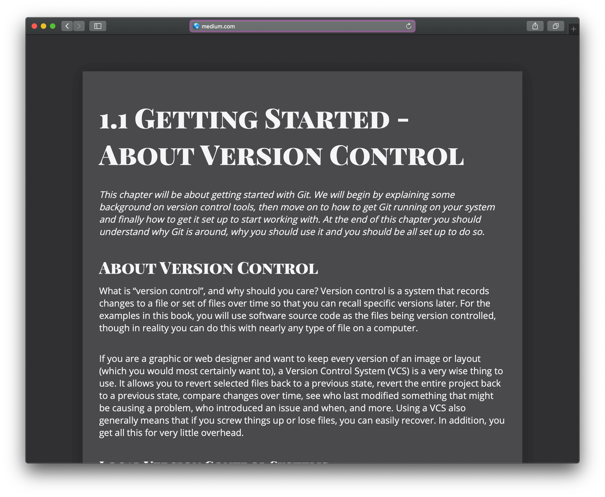

# Messy SASS - Clean up and Theming

The Sass in this file is a good example of very poor written sass. Highly over nested and unnecessary selector complexity. Because the selectors are so strict almost none of the style rules can be reused. So with the help of sass, we created something sass should actually prevent.

- we do and will repeat ourselves
- codebase becomes harder to maintain

We need to fix that, the good name of Sass is on risk.

## Tasks

1. Clean up the styles
   - clean up selectors remove unnecessary specificity
   - use partials for vars
   - typography
   - layout
   - sections (e.g. footer)

> When you are finished with task 1 [watch this](http://bit.ly/2Qqt8Tc)

2. Create Themes

   - create min. 5 different themes
   - create the theme as "DRY" as possible
   - meh with colours? Go to [dribbble.com](https://dribbble.com/), choose a design that you like. On the detail page, you will find the colour palette.

3. Create the next 2 pages
   You may have already realised, this article is from [git book](https://git-scm.com/book/en/v2/). Create the next two pages. Link them in the footer navigation.
